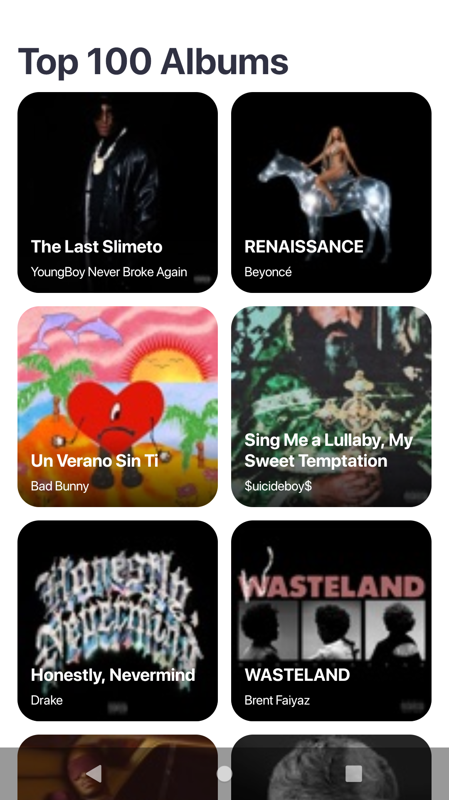
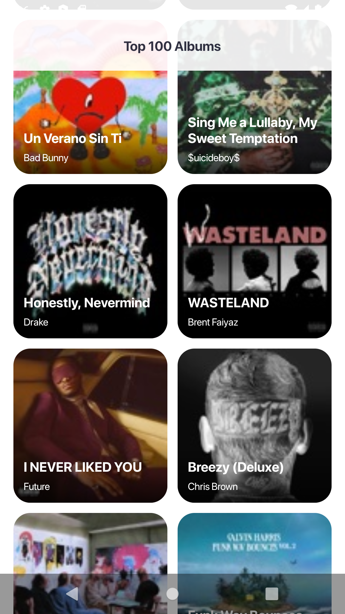

# CodigoDelSur | Vama Android Challenge 

The purpose of this project is a coding challenge using Jetpack Compose and Realm DB.

## 💻 Requirements

To run this app you need [Android Studio Arctic Fox](https://developer.android.com/studio) and JDK 11 installed on your computer.

## 📱 App overview

This is a sample app of the top 100 album on Apple music services provided by [applemarketingtools](https://rss.applemarketingtools.com/api/v2/us/music/most-played/100/albums.json). As it has been created for academic purposes, there are a lot of features that were not implemented. The main goal is to demonstrate how to build apps using Jetpack compose and Realm in a real-world.

  

## Demo Videos

1. [Happy path](readme/videos/happy_path.mp4)
2. [Error screen and retry](readme/videos/error_retry.mp4)
3. [Get data from database before fetching from API](readme/videos/albums_db.mp4)

### Albums screen

The [AlbumsScreen](app/src/main/java/com/top100/app/presentation/screens/albums/list/AlbumsScreen.kt) showcases grid how to build a screen with a top 100 list of albums in AppleMusic. You can see how to use `TabRow` and `LazyVerticalGrid` and observe how the screen is recomposed as the [AlbumViewModel](app/src/main/java/com/top100/app/presentation/screens/albums/list/AlbumsViewModel.kt).

### Album details screen

The [AlbumsDetailsScreen](app/src/main/java/com/top100/app/presentation/screens/albums/detail/AlbumDetailScreen.kt) let you know how to arrange items using  `Column`s and `Row`s, show a list of genres with `Row` and set up different styles to `Text`s and `Button`s.

### Navigation

In the project we use Navigation component for handle all the navigation

## 🛠 Architecture

We used a Compose boilerplate with MVI that CodigoDelSur has for starting new projects but we changed the code to use MVVM instead of MVI as you mentioned on requirements.

### Modules

This project is broken down into five modules:

1. `app`: The presentation module. It contains the screens implementation.

2. `domain`: A pure Kotlin module holding the business logic of the app. Use cases, models and abstract definitions of data sources reside in this module. It acts like a bridge between the `app` and the `data` module.

3. `data`: As its name suggests, this module is in charge of the data handling. It provides concrete implementations for data sources.

4. `common`: The purpose of this module is to group useful things that can be shared among projects. It holds non-android implementations.

## 🚀 Dependencies

- [Jetpack Compose Toolkit](https://developer.android.com/jetpack/compose): To build native UI with less code.
- [Navigation component](https://developer.android.com/jetpack/compose/navigation): To handle the navigation among screens.
- [Coil](https://coil-kt.github.io/coil/compose/): To load albums posters or images.
- [Hilt](https://d.android.com/hilt): For dependency injection.
- [Kotlin Coroutines](https://developer.android.com/kotlin/coroutines?gclid=Cj0KCQjwrJOMBhCZARIsAGEd4VHHTIZn0IQaxOlwjCXPBpoyuWflxN5mVvGkt9XsoGj8gJU4VnEnJdQaAoYwEALw_wcB&gclsrc=aw.ds): To handle async tasks.
- [Realm](https://realm.io/realm-kotlin/): To save the top 100 albums in a local db.
- [Retrofit](https://square.github.io/retrofit/): To handle the communication between the app and [applemarketingtools](https://rss.applemarketingtools.com/api/v2/us/music/most-played/100/albums.json) API.

## 📝 Linting

This project uses both ktlint and the regular Android lint to check the code. You can run these lints by executing either:

     ./gradlew ktlint
     ./gradlew lintDebug

ktlint errors will be shown in the console while Android lint will generate an html report which can be located in `app/build/reports`.

### Code Style

ktlint uses the official Kotlin Android Style Guide which is not the same one that Android Studio uses by default. To set this style guide in Android Studio you can run the following command:

    ./gradlew ktlint --android applyToIDEAProject

### Formatting

You can automatically fix most ktlint formatting issues by using the following command:

    ./gradlew ktlintFormat

> Note: One common issue that cannot be automatically fixed with this command is using wildcards in imports (*). So if you have not applied the Code Style before start coding, you might need to fix some of those imports manually.

### Git Hooks

Both lints can be run automatically each time you try to commit code. This is done by using the pre-commit hook that can be found in `scripts/git-hooks/pre-commit.sh`.

To install this hook you need to execute the following command:

     ./gradlew installGitHooks

This will copy the hook to `./git/hooks` from which it will be executed each time you try to commit code into your git repository. You can always remove these hooks with the following command:

    ./gradlew deleteGitHooks

Alternatively you can commit without running the hooks by using the `--no-verify` flag. For example:

    git commit -m "Some message" --no-verify

Although this is not recommended. The lint is there to ensure that no unused assets remain in the app and that the code has a standard formatting, so it is recommended to use it whenever possible.
